# Firo

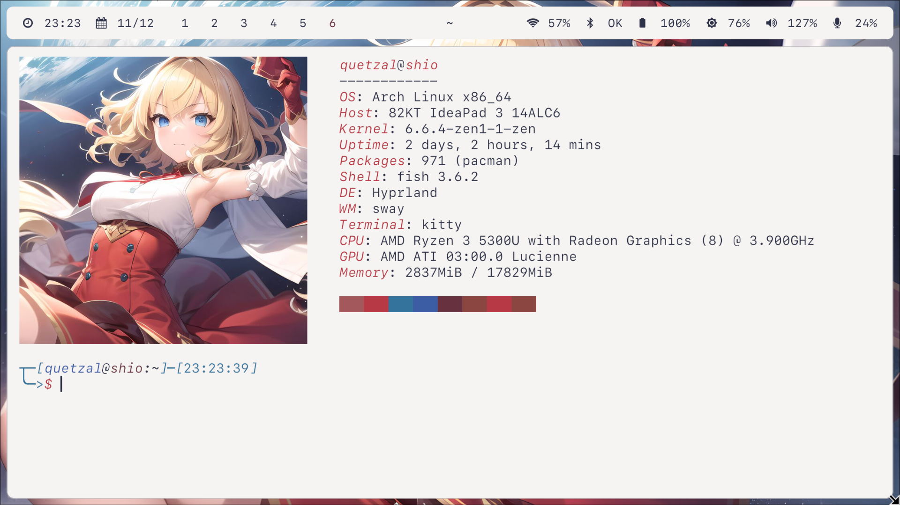

_Installer + DotFiles + Manager - V2_

## Main idea

```Firo``` allows easy and quick installation, configuration, and management of ```Hyprland```. It does not aim to replace other tools, only to quickly setup a pleasant environment.

## Interesting features

- One-step installer.
- Configuration in a single place.
- Script-manager with the ```firo``` command.
- ```Firefox```, ```VS Code```, ```Rofi```, ```Kitty```, and more colors based on the desktop background with its own color-collector: ```Fyu```.
- A pleasant and customizable environment.
- Possibility to install with Nvidia optimizations using ```--nvidia``` in the installer.

## Applications

- ```Firefox``` browser.
- ```Thunar``` file manager.
- ```Kitty``` terminal.
- ```Gnome Calculator```.
- ```Fish``` shell.
- Notifications with ```SwayNC```.
- Locking with ```SwayLock```.
- Power management with ```SwayIdle```.
- Text editor ```VS Code```.
- Top bar with ```Waybar```.
- Menus with ```Rofi```.
- Fonts ```SF Mono``` and ```JetBrains Mono```.

## Installation

1. Have ```git```, ```python```, and ```paru``` installed. An installer for ```paru``` is included for ```ArchLinux```-based distros in ```installer/scripts/install_paru.sh```.
2. Clone this repository.
3. Run the ```install``` file, *do not install as Root*, execute with ```--help``` to see different installation options.
5. Install the recommended extras.

## Recommended extras

- ```Pywalfox``` for ```Firefox```.
- ```Wal Theme``` for ```VS Code```.
- ```where is my sddm theme``` for ```SDDM```.

## Future plans

- [ ] Generated colors for ```GTK``` and ```QT```.
- [ ] Improve the installer (again).

## Limitations

- ```QT``` themes are managed by ```Kvantum```, requiring a restart of applications for the new theme to take effect.
- ```Pywalfox``` requires adjustment for the light theme (*bc by default the text has the same color as the background*).

## Screenshots


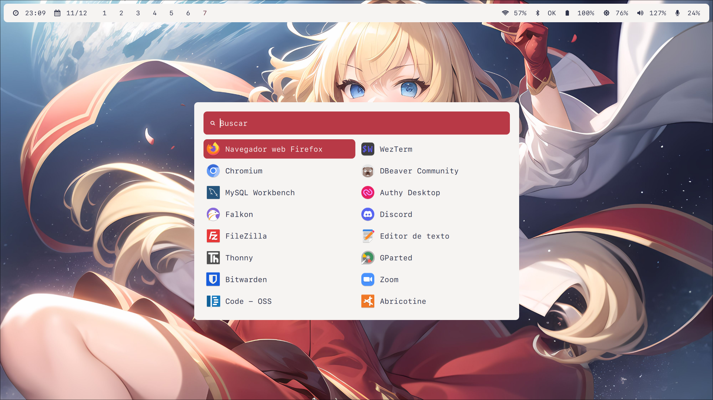

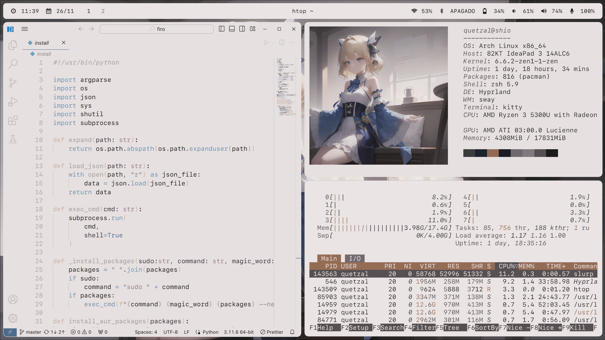
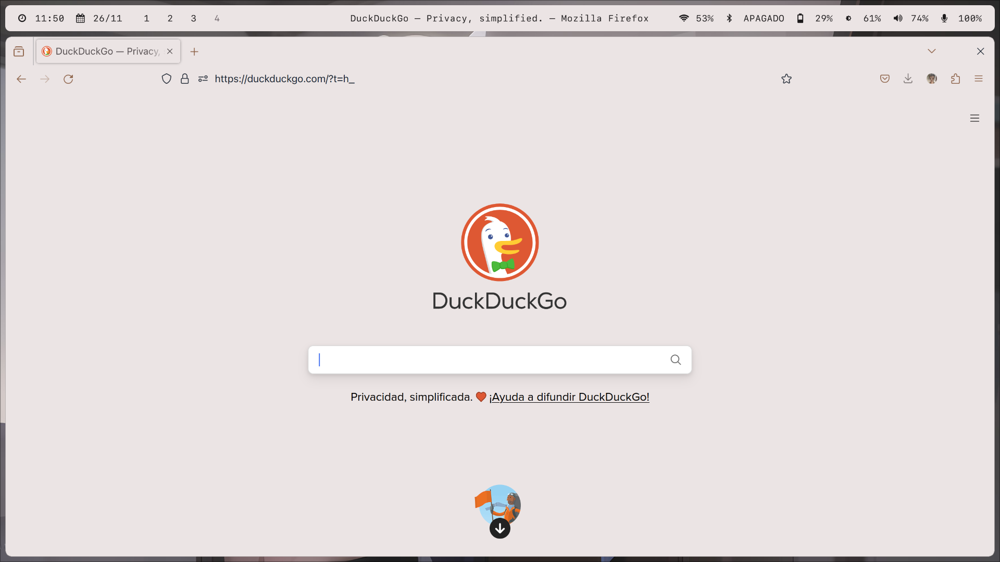
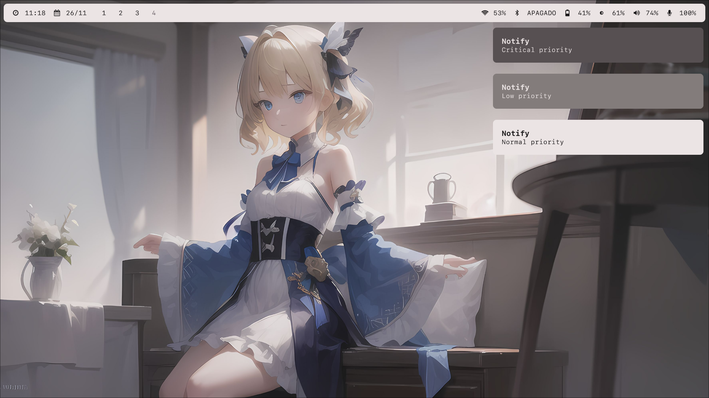
_Some of ```Fyu``` work..._
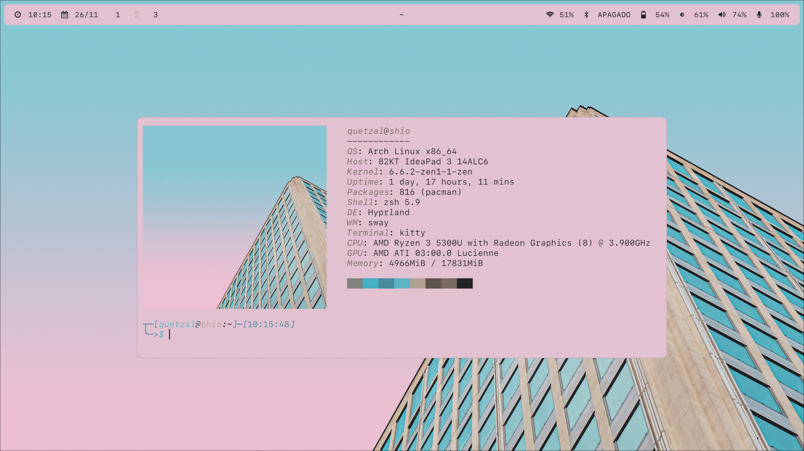
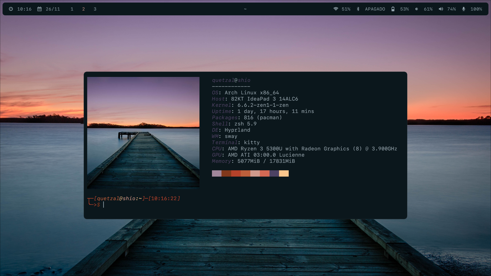
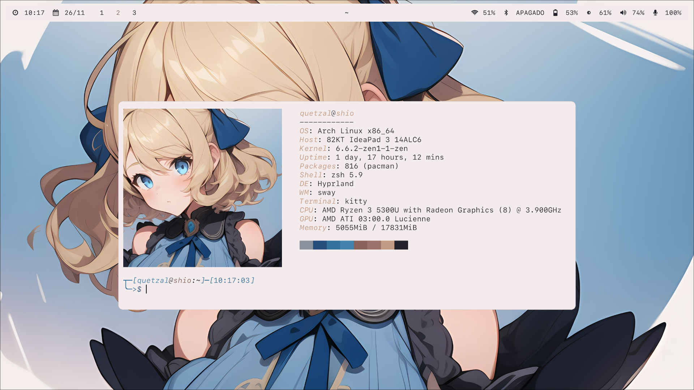
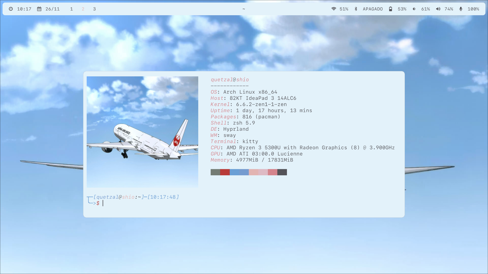
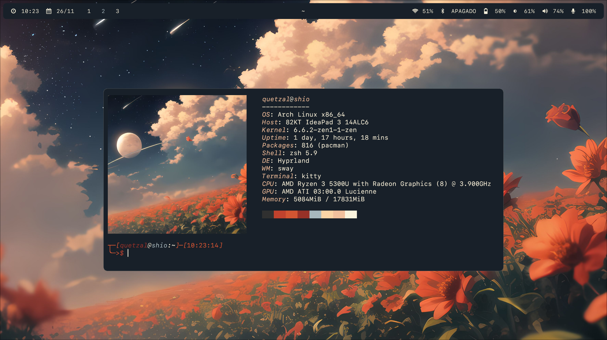
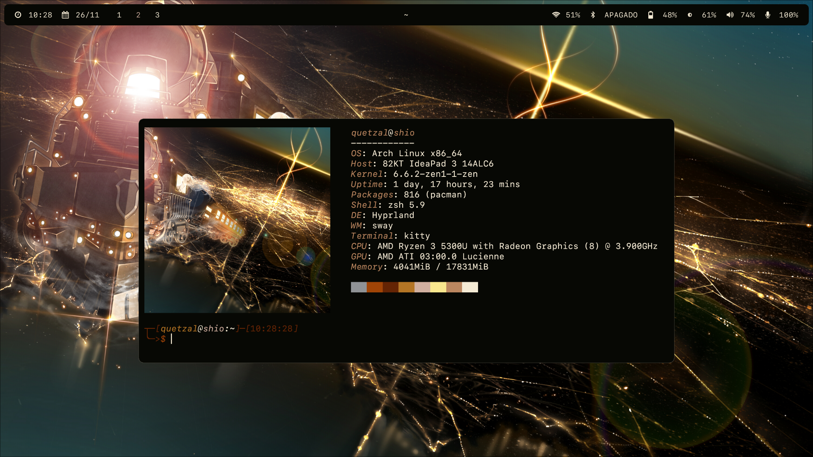
_Next, some problems with ```Fyu```..._

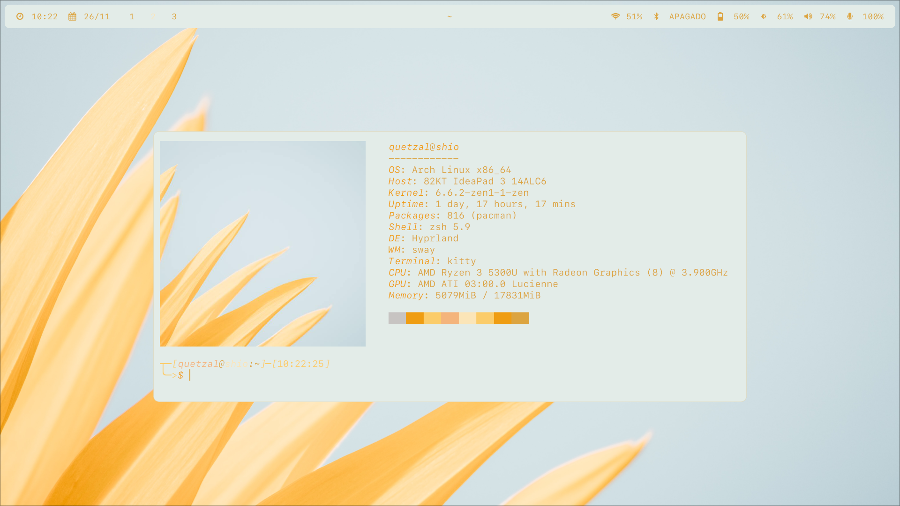
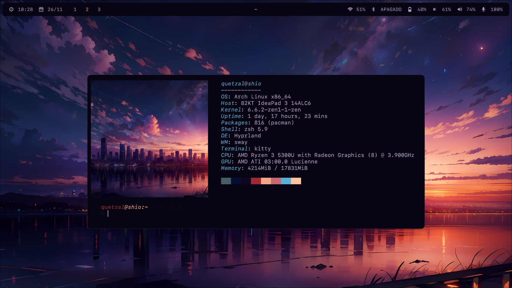

## Firo command

- Set your wallpaper with ```firo wallpaper [image]``` command, add ```-l``` if you want light schema (is dark by default), for example ```firo wallpaper /home/quetzal/wallpaper.png -l```. 
- Launch the menu ```firo launcher [menu]```, for example ```firo launcher power``` to launch power-menu.
- Control the audio with ```firo audio [device] [action]```, ```device``` can be ```mic``` or ```speaker```, action ```inc```, ```dec``` or ```mute```, for example, to mute the mic use ```firo audio mic mute```.
- Control the monitor brightness with ```firo brightness [action]```, ```action``` can be ```inc``` or ```dec```, for example, increase the brightness with ```firo brightness inc```.
- Take an screenshot with ```firo screenshot [type]```, ```type``` can be ```window```, ```screen``` or ```region```, for example, the ```Ctrl+shift+s``` uses ```firo screenshot region```.
- Control the _power_ with ```firo power [action]```, ```action``` can be ```lock```, ```suspend```, ```reboot```, ```shutdown``` or ```logout```; this command is used by the power-menu, for example, use ```firo power reboot``` if you want to reboot.

## The end
Thank you for considering using ```Firo```. It was not created with the intention of appealing to the masses but rather to quickly have an efficient and customizable desktop. I'm not very demanding, so you won't see too many fancy things. Any suggestions will be welcome. I'm thinking of including a menu for screenshots and considering options for adjusting both brightness and volume, although I still need to think about it. I should also mention that the image included in the installer is made with ```stable diffusion```, so credit goes to whoever deserves it. Finally (and to bring some closure), I will try to keep ```Firo``` updated to do a better job in more cases. If you come across an image where it does a terrible job, it will be greatly helpful to improve it.
