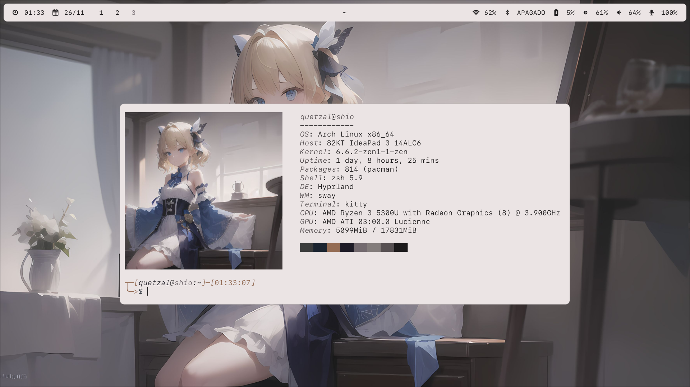

# Firo



_Installer + DotFiles + Manager - V2_

## Main idea

```Firo``` allows easy and quick installation, configuration, and management of ```Hyprland```. It does not aim to replace other tools, only to quickly setup a pleasant environment.

## Interesting features

- One-step installer.
- Configuration in a single place.
- ```Scripts``` manager with the ```firo``` command.
- ```Firefox```, ```VS Code```, ```Rofi```, ```Kitty```, and more colors based on the desktop background with its color collection system.
- A pleasant and customizable environment.
- Possibility to install with Nvidia optimizations using ```--nvidia``` in the installer.

## Applications

- ```Firefox``` browser.
- ```Thunar``` file manager.
- ```Kitty``` terminal.
- ```Gnome Calculator```.
- ```Fish``` shell.
- Notifications with ```SwayNC```.
- Locking with ```SwayLock```.
- Power management with ```SwayIdle```.
- Text editor ```VS Code```.
- Top bar with ```Waybar```.
- Menus with ```Rofi```.
- Fonts ```SF Mono``` and ```JetBrains Mono```.

## Installation

1. Have ```git```, ```python```, and ```paru``` installed. An installer for ```paru``` is included for ```ArchLinux```-based distros in ```installer/scripts/install_paru.sh```.
2. Clone this repository.
3. Run the ```install``` file, *do not install as Root*, execute with ```--help``` to see different installation options.
5. Install the recommended extras.

## Recommended extras

- ```Pywalfox``` for ```Firefox```.
- ```Wal Theme``` for ```VS Code```.
- ```where is my sddm theme``` for ```SDDM```.

## Future plans

- [ ] Generated colors for ```GTK``` and ```QT```.
- [ ] Improve the installer.

## Limitations
- ```QT``` themes are managed by ```Kvantum```, requiring a restart of applications for the new theme to take effect.
- ```VS Code``` requires font and title bar configuration.
- ```Pywalfox``` requires adjustment for the light theme (*text of the same color as the background*).
