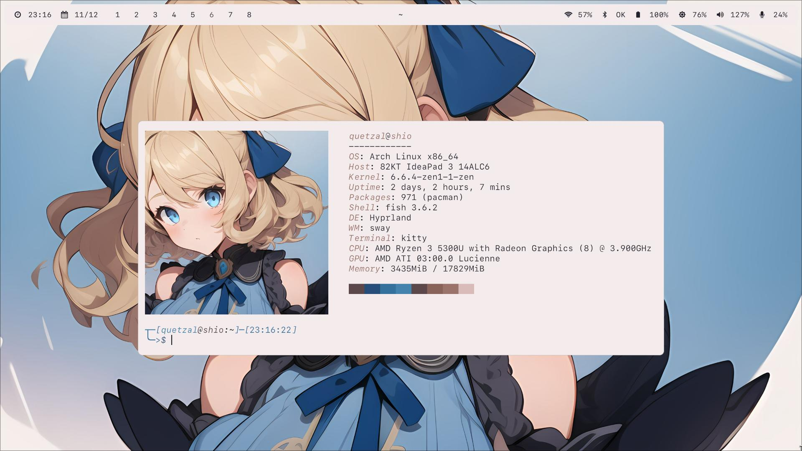

# Firo
###### 2.1.0


_Installer + DotFiles + Manager - V2.1_

## Main idea

```Firo``` allows easy and quick installation, configuration, and management of ```Hyprland```. It does not aim to replace other tools, only to quickly setup a pleasant environment.

## Interesting features

- One-step installer.
- Configuration in a single place.
- Script-manager with the ```firo``` command.
- ```Firefox```, ```VS Code```, ```Rofi```, ```Kitty```, and more colors based on the desktop background with its own color-extractor: ```Fyu```.
- A pleasant and customizable environment.
- Possibility to install with Nvidia optimizations using ```--nvidia``` in the installer.

## Applications

- ```Firefox``` browser.
- ```Thunar``` file manager.
- ```Kitty``` terminal.
- ```Gnome Calculator```.
- ```Fish``` shell.
- Notifications with ```SwayNC```.
- Locking with ```SwayLock```.
- Power management with ```SwayIdle```.
- Text editor ```VS Code```.
- Top bar with ```Waybar```.
- Menus with ```Rofi```.
- Fonts ```SF Mono``` and ```JetBrains Mono```.

## Installation

1. Have ```git```, ```python```, and ```paru``` installed. An installer for ```paru``` is included for ```ArchLinux```-based distros in ```installer/scripts/install_paru.sh```.
2. Clone this repository.
3. Run the ```install``` file, *do not install as Root*, execute with ```--help``` to see different installation options.
5. Install the recommended extras.

## Recommended extras

- ```Pywalfox``` for ```Firefox```.
- ```Wal Theme``` for ```VS Code```.
- ```where is my sddm theme``` for ```SDDM```.

## Future plans

- [ ] Generated colors for ```GTK``` and ```QT```.
- [ ] Improve the installer (again).
- [ ] Improve ```Fyu``` (again).

## Limitations

- ```QT``` themes are managed by ```Kvantum```, requiring a restart of applications for the new theme to take effect.
- ```Pywalfox``` requires adjustment for the light theme (*bc by default the text has the same color as the background*).

## Screenshots


_Some of ```Fyu``` work..._




## Firo command

- Set your wallpaper with ```firo wallpaper [image]``` command, add ```-l``` if you want light schema (is dark by default), for example ```firo wallpaper /home/quetzal/wallpaper.png -l```. 
- Launch the menu ```firo launcher [menu]```, for example ```firo launcher power``` to launch power-menu.
- Control the audio with ```firo audio [device] [action]```, ```device``` can be ```mic``` or ```speaker```, action ```inc```, ```dec``` or ```mute```, for example, to mute the mic use ```firo audio mic mute```.
- Control the monitor brightness with ```firo brightness [action]```, ```action``` can be ```inc``` or ```dec```, for example, increase the brightness with ```firo brightness inc```.
- Take an screenshot with ```firo screenshot [type]```, ```type``` can be ```window```, ```screen``` or ```region```, for example, the ```Ctrl+shift+s``` uses ```firo screenshot region```.
- Control the _power_ with ```firo power [action]```, ```action``` can be ```lock```, ```suspend```, ```reboot```, ```shutdown``` or ```logout```; this command is used by the power-menu, for example, use ```firo power reboot``` if you want to reboot.

## The end
Version 2.1 has arrived, featuring a significant improvement to ```Fyu``` (the system that retrieves desktop background colors). In this new version, you won't encounter unreadable colors anymore.

Once again, thank you for considering using ```Firo```. Our aim is not to reach large audiences; it's simply a personal project to create a pleasant and fast environment in ```Hyprland```.

It's worth mentioning that the wallpaper included in this new release is brought to you thanks to ```stable diffusion```, so credit goes to the rightful owner.

There are still quite interesting things to come, such as ```Fiyu II``` (a significant enhancement to ```Fyu```), menu for screenshots, optimizations (and improvements) to existing menus and more, but all in due time...

###### README 2.1.1
